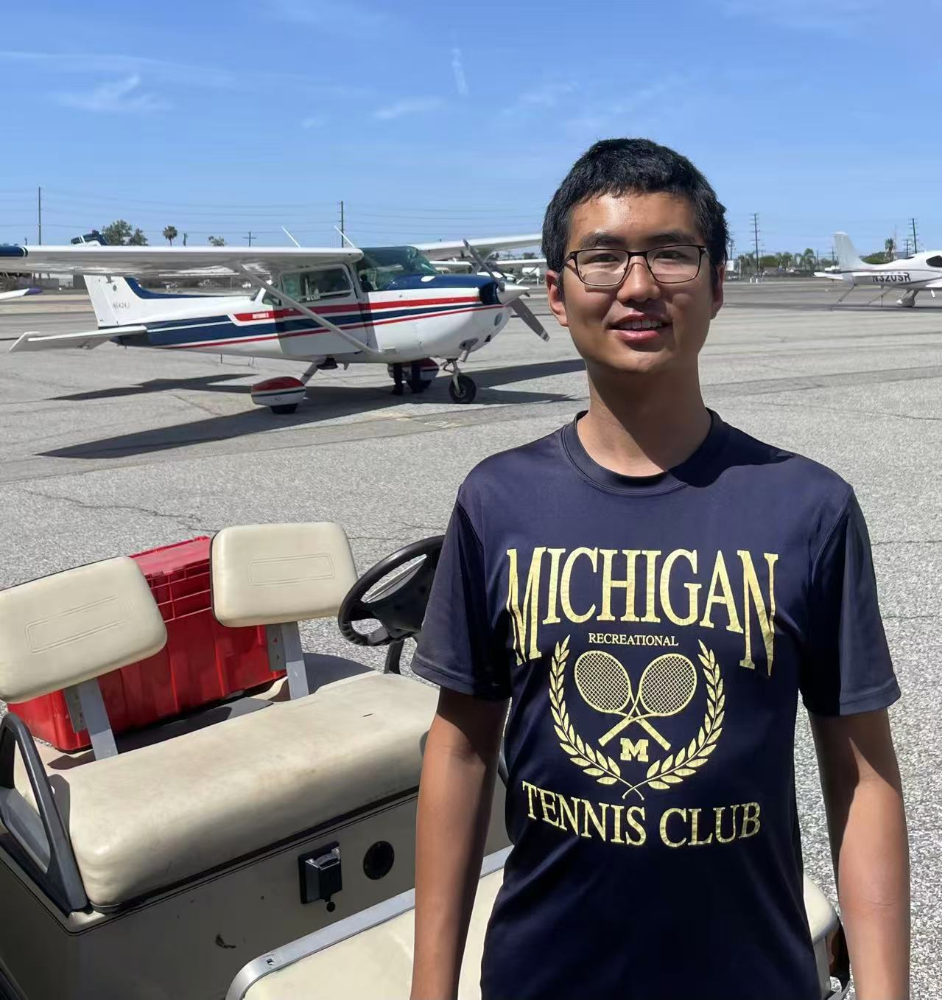

Computer Science (Artificial Intelligence) Master's student in USC

Research Interest: LLM, agentic system, reinforcement learning, rule-based AI

[Paper Published or Under Review](papers/index.md)

[SJTU Undergraduate Capstone Project (毕业设计)](capstone/index.md)

[Crafty Piggies 3D for Game Development Course](crafty_piggies/index.md)

[Thoughts on explicit and explainable AI](glassboxwisdom.com)

[Research Projec Proposal for a "Backboned" Explainable AI](proposal/index.md)

[Zelda Game for Game Development Course](zelda_game/index.md)

[Transcribed Piano Sheets](piano_sheets/index.md)

[Transcripts and TOEFL Score](transcripts/index.md)

<a href="https://LuoZheng2002.github.io/resume_general.pdf" download>Resume</a>
