<link rel="stylesheet" href="site.css">

<nav class="site-nav" aria-label="Primary navigation">
<a class="brand" href="#top">Zheng Luo</a><ul class="site-nav-links"><li><a href="#research">Research</a></li><li><a href="#publications">Publications</a></li><li><a href="#projects">Projects</a></li><li><a href="#hobbies">Hobbies</a></li><li><a href="#skills">Skills</a></li></ul>
</nav>

<main class="home" id="top">
<section class="hero" aria-labelledby="home-heading">

Computer Science · Artificial Intelligence
<h1 id="home-heading">Zheng Luo</h1>
I am currently a Master's student at University of Southern California majoring in Computer Science (Artificial Intelligence). I am supervised by <a href="https://xiyanghu.github.io/">Prof. Xiyang Hu</a> from ASU and <a href="https://viterbi-web.usc.edu/~yzhao010/">Prof. Yue Zhao</a> from USC in LLM research. I earned my bachelor's degree from Shanghai Jiao Tong University (UM-SJTU Joint Institute) where I majored in Electrical and Computer Engineering and the University of Michigan where I majored in Computer Science.

<a href="resume_general.pdf" download>CV / Resume</a><a href="mailto:luozheng@usc.edu">Email: luozheng@usc.edu</a><a href="https://github.com/LuoZheng2002">Github Page</a><a href="#transcripts">Transcripts</a>

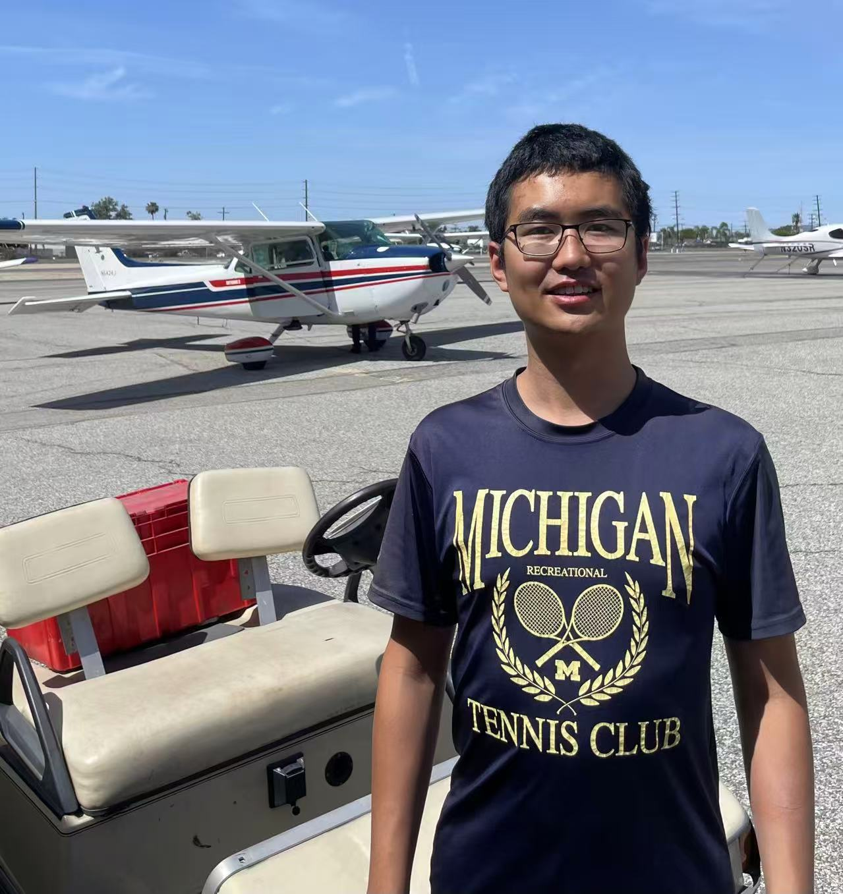
</section>

<section class="section" id="research" aria-labelledby="research-heading"><h2 class="section-heading" id="research-heading">Research Interest</h2>

My long-term research interest can be summarized as general intelligence like LLMs that are more efficient, more reliable, more predictable, and more "logically beautiful" (see more <a href="detailed_research_interest/">here</a>). I envision my ultimate goal to not be adding incremental improvements on existing systems (like transformer architecture) regarding efficiency, etc., but to found a fundamentally new paradigm that eliminates the structural limitations of the traditional connectionist (deep learning) paradigm, like being data-hungry and lacking safety guarantee, by making bold sacrifices (like devoting much more manual effort in addition to automatic learning). However, this is very hard and potentially requires long-term trials and errors. Therefore, to make things realistic, I am open to any theoretical (as opposed to applied) AI fields as research directions for my Ph.D studies, especially LLM training and fine-tuning, and multimodal generative models including image, video and 3D model generation, and seek to learn the frontier approaches, be up-to-date with latest ideas, and gradually migrate useful insights to my own research direction. <a href="ai_field_understanding/">See my preliminary understanding of the current general-purpose AI field</a> and <a href="long_term_research_plan/">my long-term research plan</a> for more.

My short-term research plan for my Ph.D studies can be found <a href="short_term_research_plan/">here</a>.

</section>

<section class="section" id="publications" aria-labelledby="publications-heading"><h2 class="section-heading" id="publications-heading">Publications and Research Experiences</h2>

<article class="paper">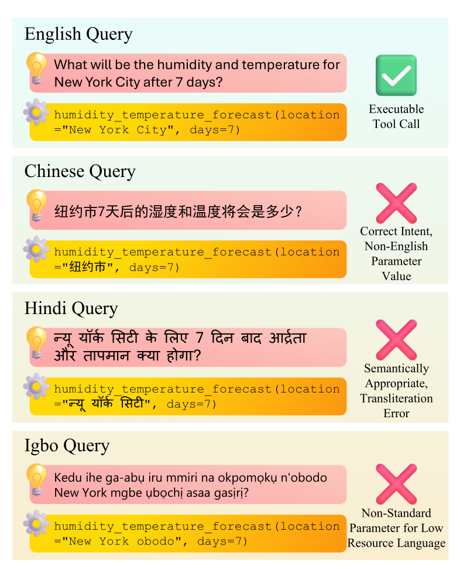
<h3 class="paper-title">Lost in Execution: On the Multilingual Robustness of Tool Calling in Large Language Models</h3>Published - ACL 2026First Author
<a href="papers/lost_in_execution.pdf" download>Download paper</a> · <a href="https://aclanthology.org/2026.acl-long.2039/">Venue page</a>

Project description

<strong>Lost in Execution</strong> studies <strong>multilingual robustness</strong> in LLM tool calling. The paper introduces <strong>MLCL</strong>, a diagnostic benchmark across English, Chinese, Hindi, and Igbo, and shows that models may understand intent and select the right tool but still fail because parameter values are not executable. The key failure mode is <strong>parameter-value language mismatch</strong>, where semantically correct non-English arguments violate tool-interface conventions.

I am the <strong>first author</strong> of this <strong>ACL 2026</strong> paper. I built the benchmark, designed the <strong>fine-grained error taxonomy</strong>, analyzed failures across intent, tool selection, parameter extraction, and execution mismatch, and evaluated mitigation strategies. This project highlighted my ability to connect benchmark design with practical agent reliability.

</article>
<article class="paper">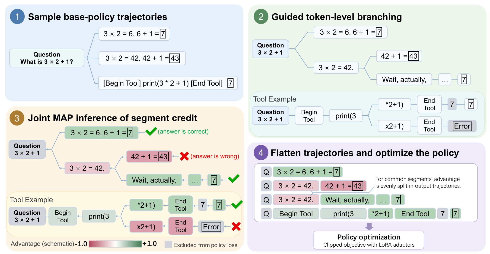
<h3 class="paper-title">TreeMPO: Fine-Grained Credit Assignment for LLM Training via Token-Level Trajectory Branching</h3>ManuscriptFirst Author
<a href="papers/treempo.pdf" download>Download paper</a>

Project description

<strong>TreeMPO</strong> studies <strong>fine-grained credit assignment</strong> for long LLM reasoning trajectories. Instead of assigning one reward to an entire response, it branches token-level trajectories, estimates <strong>segment-level contribution</strong> from mixed-success descendants, and converts the evidence into token-level advantages for LoRA/RL fine-tuning. The method supports mathematical reasoning and <strong>tool-calling traces</strong>, with consistent validation gains across several model families.

I am the <strong>first author</strong> of this manuscript in preparation. I designed the core TreeMPO algorithm, including the <strong>token-level branching strategy</strong>, contribution model, and advantage-generation pipeline, and built the full system for rollout collection, trajectory-tree construction, LoRA fine-tuning, and checkpoint validation under constrained GPU resources.

</article>
<article class="paper">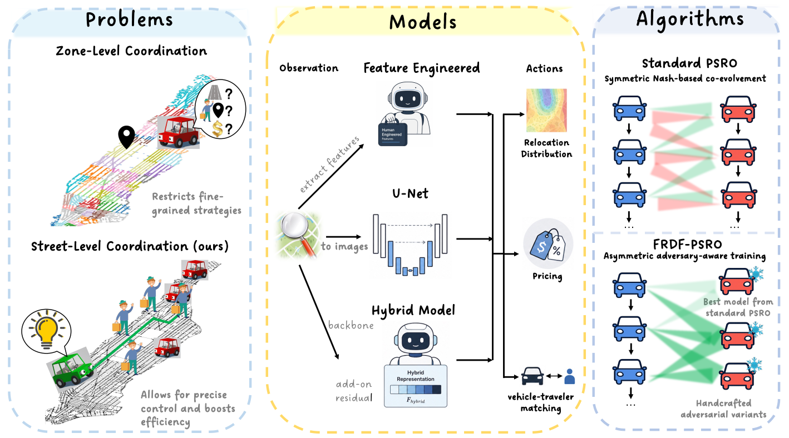
<h3 class="paper-title">Street-Level Competitive Ride-Hailing with Fixed-Rival Defensive PSRO</h3>Submitted - AAAI 2027First Author
<a href="papers/street_level.pdf" download>Download paper</a>

Project description

<strong>Street-Level Competitive Ride-Hailing with Fixed-Rival Defensive PSRO</strong> studies competitive fleet management at <strong>street-level resolution</strong> rather than coarse zone level. The paper introduces a <strong>SUMO-backed competitive ride-hailing simulator</strong> calibrated with NYC TLC and OpenStreetMap data, evaluates structured and residual policy designs, and proposes <strong>Fixed-Rival Defensive PSRO</strong> for robustness against strategically difficult rivals.

I am the <strong>first author</strong> of this <strong>AAAI 2027 submission</strong>. I developed the simulation framework, designed street-level controller features for relocation, pricing, and service decisions, implemented Manhattan-scale evaluation pipelines, and proposed the <strong>FRDF-PSRO</strong> protocol for robust multi-agent decision-making under competitive pressure.

</article>
<article class="paper">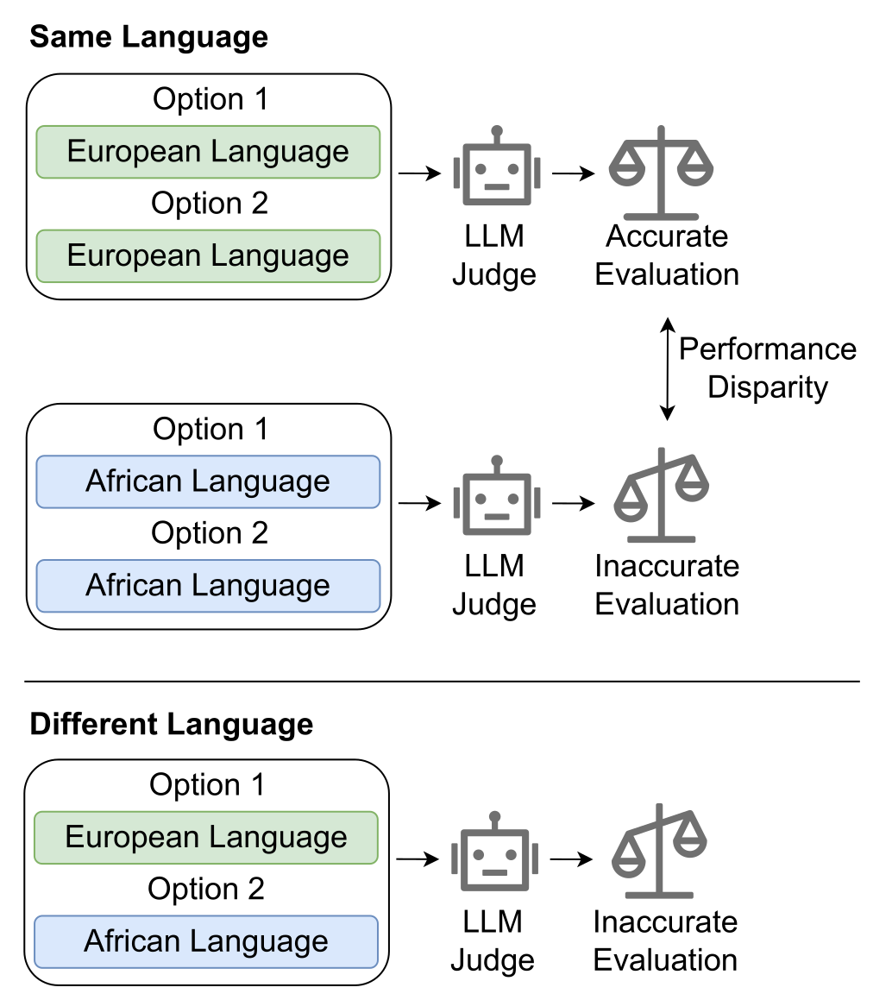
<h3 class="paper-title">Fairness or Fluency? An Investigation into Language Bias of Pairwise LLM-as-a-Judge</h3>Submitted - NeurIPS 2026 Workshop JUDGe
<a href="papers/fairness_or_fluency.pdf" download>Download paper</a>

Project description

<strong>Fairness or Fluency?</strong> studies <strong>language bias</strong> in pairwise LLM-as-a-judge evaluation. The paper finds performance disparities across language families and shows that many models prefer English answers in cross-language comparisons. It further tests whether this bias is explained by answer perplexity, finding that perplexity is correlated with bias but <strong>does not fully explain language preference</strong>.

I contributed to this <strong>NeurIPS 2026 Workshop JUDGe submission</strong> as a co-author. My role focused on designing and implementing experiments that relate judge preference to answer perplexity, using <strong>regression-based analysis</strong> to separate language identity from fluency effects, and improving perplexity collection for more reliable multilingual evaluation.

</article>
<article class="paper">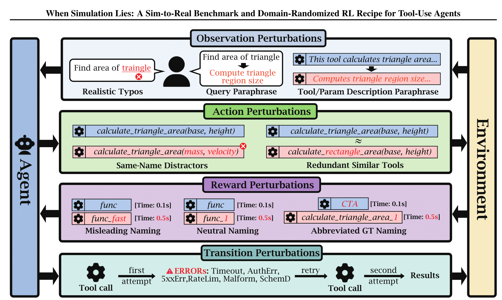
<h3 class="paper-title">When Simulation Lies: A Sim-to-Real Benchmark and Domain-Randomized RL Recipe for Tool-Use Agents</h3>Published - NeurIPS 2026 Evaluations and Datasets Track, poster
<a href="papers/sim_2_real.pdf" download>Download paper</a> · <a href="https://arxiv.org/abs/2605.11928">arXiv page</a>

Project description

<strong>When Simulation Lies / RobustBench-TC</strong> frames tool-use robustness as a <strong>sim-to-real problem</strong>. It introduces a production-grounded benchmark with perturbations organized by POMDP components: observation, action space, reward-relevant metadata, and transition dynamics. Across 21 models, the study finds that reward-relevant and transition perturbations cause much larger failures than simple observation noise, and proposes <strong>ToolRL-DR</strong> to narrow robustness gaps through perturbation-augmented RL.

I contributed to this <strong>NeurIPS 2026 Evaluations and Datasets Track poster</strong> as a co-author. My work included implementing user-query perturbations on ACEBench, supporting robustness experiments under deployment-like noise, and contributing to the analysis showing that <strong>perturbation-augmented RL</strong> can improve tool-use robustness beyond clean benchmark accuracy.

</article>
<article class="paper">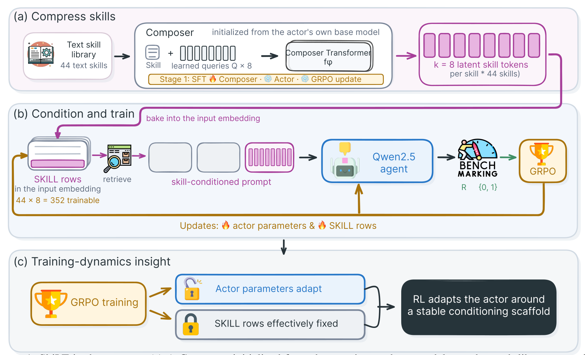
<h3 class="paper-title">SkiLT: What Agent Reinforcement Learning Actually Learns from a Latent Skill Library</h3>Submitted - AAAI 2027
<a href="papers/latent_skill.pdf" download>Download paper</a>

Project description

<strong>SkiLT</strong> studies whether retrieved text-skill libraries for LLM agents can be compressed into <strong>compact latent skill tokens</strong> during reinforcement learning. It reduces the skill section from roughly <strong>970 tokens to 140 tokens per step</strong> while maintaining performance comparable to text-skill RL checkpoints on ALFWorld. The mechanism analysis further shows that the actor may adapt around nearly fixed skill rows, complicating the interpretation of what latent skill conditioning actually contributes.

I contributed to this <strong>AAAI 2027 submission</strong> as a co-author. My work included designing and implementing <strong>latent-form skill compression</strong>, integrating compact skill tokens into the GRPO workflow, evaluating against text-skill RL baselines, and helping analyze training dynamics to understand what agent RL actually learns from auxiliary skill memory.

</article>

</section>

<section class="section" id="projects" aria-labelledby="projects-heading"><h2 class="section-heading" id="projects-heading">Project Experiences</h2>

<article class="project"><h3>"Crafty Piggies 3D" Game Development</h3>

<iframe class="media-frame" src="https://www.youtube.com/embed/zd16g53LavQ" title="Game Trailer" loading="lazy" allowfullscreen></iframe>
Game Trailer

<iframe class="media-frame" src="https://www.youtube.com/embed/FIf5dbHN1ss" title="Demo Day Trailer Reaction" loading="lazy" allowfullscreen></iframe>
Demo Day Trailer Reaction

<a href="https://luozheng2002.itch.io/crafty-piggies-gold">Play the game on Windows and Mac</a>

"Crafty Piggies 3D" is a physics-based 3D game that allows players to build customized vehicles through a grid-based system and control their vehicles to solve puzzles and reach destinations. It is inspired by Bad Piggies and Genshin Impact, where the former features a 2D grid-based building system and level-based progression, and the latter features an open world and a dedicated storyline. We tried to fuse the two genres together to create a game that is both mechanically fun and appealing in storytelling.

This is a capstone project for graduating from the University of Michigan, where I worked with Yikai Li, Gabriel Froehner and Javier Guerrero, instructed by Prof. Austin Yarger.
</article>
<article class="project"><h3>Table Tennis Feeding Machine</h3>
<iframe class="media-frame" src="https://www.youtube.com/embed/Eg9H1ohUx7M" title="Table Tennis Feeding Machine video one" loading="lazy" allowfullscreen></iframe><iframe class="media-frame" src="https://www.youtube.com/embed/D8YpBVKRTdU" title="Table Tennis Feeding Machine video two" loading="lazy" allowfullscreen></iframe>

This is an Embedded Systems course project, where each team decides their own topic. Our team is composed of Zheng Luo (me), Zhiheng Alex Zhang, Xinting Jiang and Mingjian Li, and I was the team leader.

Our project features a vehicle with omniwheels topped with a pinch roller that feeds table tennis balls. It can move and rotate freely in all directions, adjust launching angle, launching speed and even spin.

One interesting fact about this project is that the pinch roller (the top white part of the vehicle) is fully handmade by us, with a 3D printed barrel, embedded with two brushless motors that spin independently and accumulate inertia for a full-speed launching. Stepper motors are used for pitch angle and launch triggering. It was a quite crazy idea from me, given that we have to make every piece to function correctly, or otherwise the whole project will fail.
</article>
<article class="project"><h3>"Defend the Republic" Autonomous Blimp Competition</h3>
<iframe class="media-frame" src="https://www.youtube.com/embed/CUvsu1nkoa8" title="Defend the Republic autonomous blimp competition" loading="lazy" allowfullscreen></iframe>

This competition involves building a floating blimp that can collect balloons in the air and transport them to a goal. I learned about rule-based control algorithms like PID control and the feasibility of using embedded-system-powered YOLO algorithm for object detection.
</article>

</section>

<section class="section" id="hobbies" aria-labelledby="hobbies-heading"><h2 class="section-heading" id="hobbies-heading">Personal Hobbies</h2>

<article class="project"><h3>AI Short Play Making</h3>
<iframe class="media-frame" src="https://www.youtube.com/embed/ATH4GIfw3lE" title="AI short play" loading="lazy" allowfullscreen></iframe>

An AI short play depicting a possible parallel world where humans were fooled by aliens into believing they have invented LLM, but it turns out that the intelligent words from LLMs are synthesized by the aliens and presented to the human eyes. This is to banter the fact that we have absolutely no idea whether a deep learning method will work until we see the experiment results, and when a method turns out to be working, we go back to justify it with all kinds of theories, while if the outcome were bad, we would throw the same method into trashcan and use theories to justify why it doesn't work.
</article>
<article class="project"><h3>Game Engine Development</h3>
I contributed to the <a href="https://github.com/FyroxEngine/Fyrox">Fyrox game engine</a>, including exposing physics-related APIs from downstream dependencies and miscellaneous refactoring and cleanup.

This is a physics test on the Fyrox game engine regarding my "Crafty Piggies 3D" game idea.

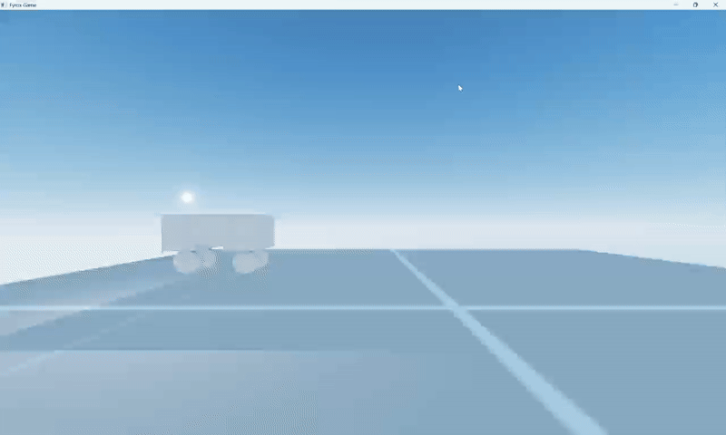

I aim to build my own game engine from scratch so that I can have full control over the physics and rendering details, and also seek for the possibility of developing a "game engine development skill" for AI agents so that every new indie game can have a customized engine tailored to its unique needs.
</article>
<article class="project"><h3>Personal Music Box Project</h3>

<iframe class="media-frame" src="https://www.youtube.com/embed/2swCZ2V19NA" title="Appearance and Internals Display" loading="lazy" allowfullscreen></iframe>
Appearance and Internals Display

<iframe class="media-frame" src="https://www.youtube.com/embed/g1gPUi-Pj-o" title="Functionality Demo" loading="lazy" allowfullscreen></iframe>
Functionality Demo

This is a personal project whose initial purpose was to be given to a girl I secretly liked, but the outcome beyond the project itself does not end well.

It is a music box that can play music, emit beautiful lights, has a spinning part, and plays a weird sound effect after the power is fully turned off (yes, this is a feature I'm really proud of). The initial design involves planet gears that speed down the brushless motor and enable two platform rings to spin in opposite directions. However, I eventually found that the friction and noise caused by 3D printed and laser-cut gears were too much, so I had to give up the fancy plan and connect the crystal piano to the brushless motor directly.

I got familiar with various skills through this project, including PCB milling, 3D printing and laser cutting.

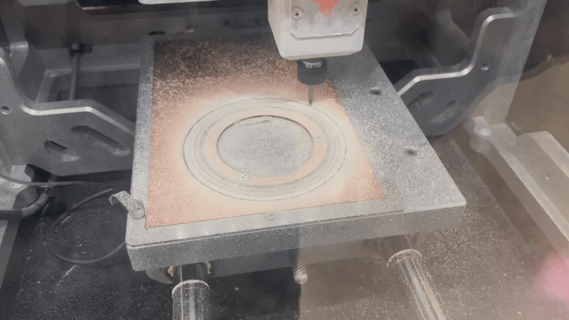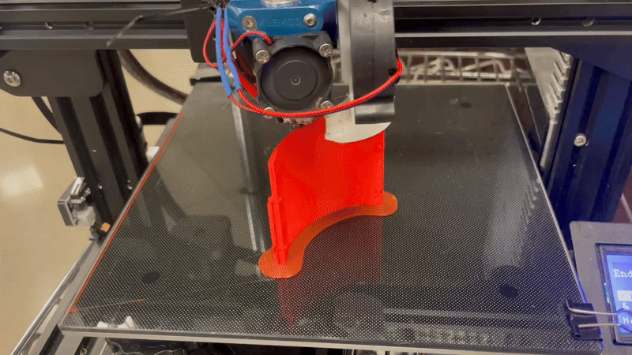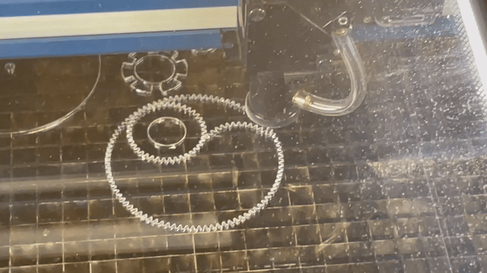
</article>
<article class="project"><h3>Piano Sheet Transcribing</h3>
I transcribed many beautiful piano pieces whose sheets cannot be found online or not faithful to the original score. This is done with the aid of an AI transcriber software <a href="https://lunaverus.com/">AnthemScore</a>. A video example is available <a href="https://www.bilibili.com/video/BV13g4y117nS">here</a>.

Transcribed piano sheets

<a href="piano_sheets/river_flows_in_you.pdf">River Flows In You PDF</a>, <a href="piano_sheets/river_flows_in_you.musicxml">MusicXML</a>, <a href="piano_sheets/river_flows_in_you.mscz">MuseScore</a>

<a href="piano_sheets/melody13.pdf">Melody of the Night No.13 PDF</a>, <a href="piano_sheets/melody13.musicxml">MusicXML</a>, <a href="piano_sheets/melody13.mscz">MuseScore</a>

<a href="piano_sheets/evening_readings.pdf">Evening Readings PDF</a>, <a href="piano_sheets/evening_readings.musicxml">MusicXML</a>, <a href="piano_sheets/evening_readings.mscz">MuseScore</a>

<a href="piano_sheets/once_upon_a_memory.pdf">Once Upon a Memory PDF</a>, <a href="piano_sheets/once_upon_a_memory.musicxml">MusicXML</a>, <a href="piano_sheets/once_upon_a_memory.mscz">MuseScore</a>

</article>

</section>

<section class="section" id="transcripts" aria-labelledby="transcripts-heading"><h2 class="section-heading" id="transcripts-heading">Transcripts and Scores</h2>

Open transcript and TOEFL downloads

<a href="transcripts/SJTU_transcript.pdf" download>SJTU Transcript</a>

<a href="transcripts/um_transcript.pdf" download>University of Michigan Transcript</a>

<a href="transcripts/usc_unofficial.pdf" download>USC Transcript</a>

<a href="transcripts/toefl_score.pdf" download>TOEFL Score</a>

</section>

<section class="section" id="skills" aria-labelledby="skills-heading"><h2 class="section-heading" id="skills-heading">Skills</h2>

<h3>Programming Languages</h3><ul class="skill-list"><li>Python</li><li>Rust</li><li>C++</li><li>C#</li><li>TypeScript</li></ul>

<h3>Machine Learning</h3><ul class="skill-list"><li>PyTorch</li><li>Scikit-learn</li><li>LoRA fine-tuning</li><li>Model evaluation</li><li>Ablation studies</li></ul>

<h3>Software and Infrastructure</h3><ul class="skill-list"><li>Git</li><li>Docker</li><li>Slurm / HPC</li><li>Apptainer</li><li>Linux</li></ul>

<h3>Simulation and Graphics</h3><ul class="skill-list"><li>SUMO</li><li>Unity</li><li>Unreal Engine 5</li><li>Fyrox</li><li>Blender</li></ul>

</section>
</main><footer class="site-footer">© Zheng Luo · <a href="mailto:luozheng@usc.edu">Contact</a></footer>
